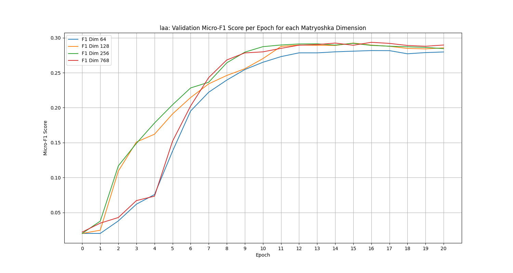
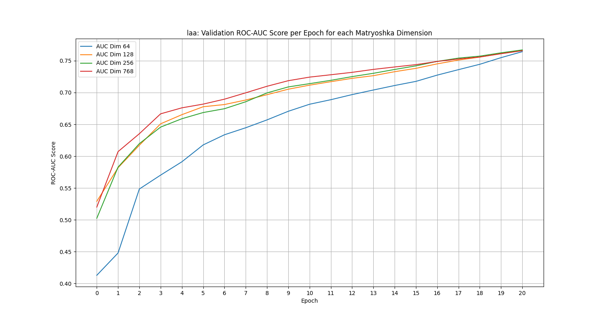
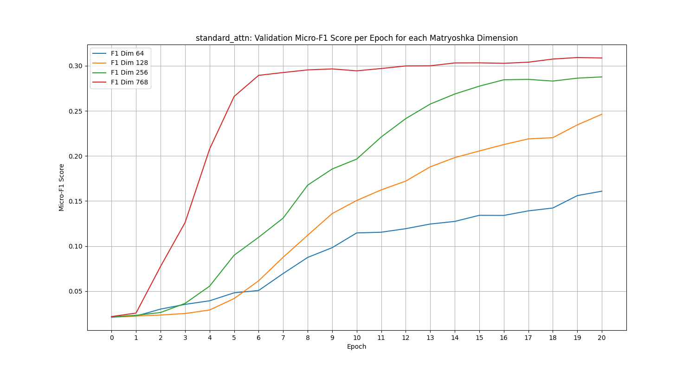
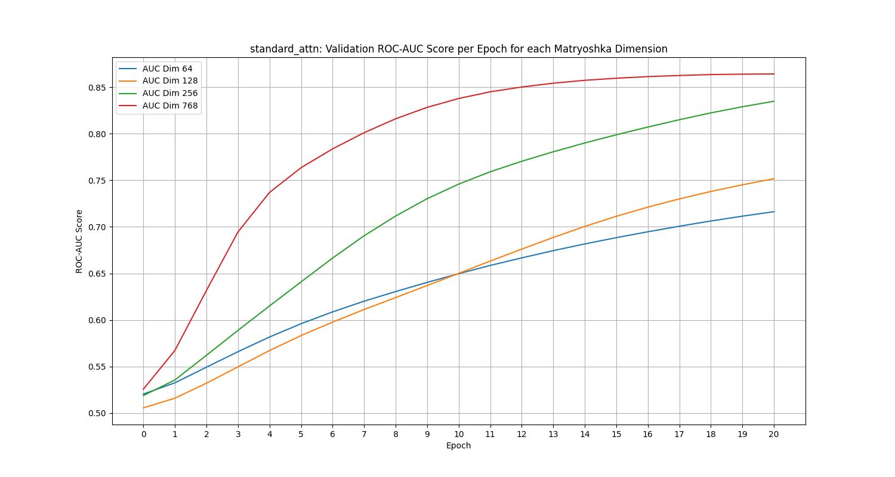

# Matryoshka-ICD: Automated ICD Coding with MRL

**Matryoshka-ICD** implements an automated ICD coding system for clinical reports (e.g., MIMIC-CXR). By combining **Matryoshka Representation Learning (MRL)** with **Label-Aware Attention (LAA)**, the model learns nested embeddings that perform efficiently at multiple dimensions (e.g., 64, 128, 768). This allows for adaptive deployment—scaling inference speed and storage usage without needing to retrain the model.

## key Features

- **Matryoshka Representation Learning (MRL)**: Learns a "Russian Doll" structure in embeddings, ensuring the first $k$ dimensions form a high-quality representation.
- **Label-Aware Attention**: Computes specific attention weights for each label to capture relevant clinical evidence from long documents.
- **Flexible Inference**: Evaluate using 64, 128, 256, or 768 dimensions depending on your computational budget.
- **BioClinical-ModernBERT Backbone**: Leverages state-of-the-art medical language models.
- **Ablation Ready**: Seamlessly toggle between Label-Aware Attention, Standard Attention, and Dense Retrieval Bi-Encoder models via command-line tags.


## Performance & Results

The system evaluates **Micro-F1**, **ROC-AUC**, and **Precision@5** independently for each nesting dimension (e.g., 64d vs 768d). Integrated into the `src/utils.py` module are tools that automatically generate grouped bar charts and validation curves to track these metrics across training epochs for ablation analysis. See `project_report.md` for theoretical background and details.

### Results on Preliminary Dataset

> [!NOTE]
> **Dataset Size Constraints**
> The current evaluation relies on a very small preliminary subset of the MIMIC-CXR dataset (5,749 training reports, 37 validation reports, 41 test reports). Consequently, absolute metric values are relatively low. However, this environment perfectly demonstrates the *relative robustness* between the architectures when tested on identical data constraints.

As shown in the table below, combining **Label-Aware Attention (LAA)** with **Matryoshka Representation Learning (MRL)** produces highly robust embeddings. Even on this preliminary dataset, our LAA model retains nearly all its performance when truncating the embedding size from 768 to 64 dimensions. For example, the Micro-F1 score experiences almost zero degradation (0.2516 at 768d vs. 0.2500 at 64d), and the ROC-AUC remains remarkably stable.

In contrast, the **Standard Attention** baseline suffers significant performance drops when dimensions are reduced (Micro-F1 drops from 0.2616 to 0.1621, and ROC-AUC drops from 0.8810 to 0.6899). The **Retrieval** baseline also shows degradation at lower dimensions, in addition to poor overall performance due to the dataset size constraints and the frozen backbone setup. 

This confirms that LAA effectively isolates label-specific evidence, allowing MRL to pack critical information into the earliest dimensions much more efficiently than standard pooling or retrieval methods.

| Model | Dim | Micro-F1 | ROC-AUC | Precision@5 |
| :--- | :--- | :--- | :--- | :--- |
| **LAA (Ours)** | 768 | 0.2516 | 0.7837 | 0.4098 |
| **LAA (Ours)** | 256 | 0.2568 | 0.7929 | 0.4146 |
| **LAA (Ours)** | 128 | 0.2533 | 0.7904 | 0.4049 |
| **LAA (Ours)** | 64 | 0.2500 | 0.7898 | 0.4098 |
| Standard Attn | 768 | 0.2616 | 0.8810 | 0.4293 |
| Standard Attn | 256 | 0.2567 | 0.8296 | 0.4146 |
| Standard Attn | 128 | 0.2181 | 0.7363 | 0.4098 |
| Standard Attn | 64 | 0.1621 | 0.6899 | 0.4195 |
| Retrieval | 768 | 0.0278 | 0.5827 | 0.0195 |
| Retrieval | 256 | 0.0250 | 0.5664 | 0.0244 |
| Retrieval | 128 | 0.0239 | 0.5524 | 0.0195 |
| Retrieval | 64 | 0.0226 | 0.5378 | 0.0195 |

### Ablation Plots

The validation plots across dimensions explicitly show how LAA maintains a tight grouping between 64d and 768d during training, whereas the Standard Attention curves are significantly spread out. This visually demonstrates the higher embedding efficiency at lower dimensions compared to the standard approach.

#### 1. Label-Aware Attention (LAA)




#### 2. Standard Attention




## Installation

1.  Clone the repository:
    ```bash
    git clone https://github.com/hassen8/Matryoshka-ICD.git
    cd Matryoshka-ICD
    ```

2.  Install dependencies:
    ```bash
    pip install -r requirements.txt
    ```

## Usage

### Dataset

The dataset structure is based on the MIMIC-CXR dataset. A preprocessed version of the dataset `mimicxr_parsed_ds.jsonl` was handproduced in the wide format which contained a multiple rows per patient for every applicable and/or adjacent ICD code. This was then collapsed to represent a multi-label classification problem. The preprocessing script at `src/dataset/preprocess.py` was used for this dataset.

In the future, i plan to introduce a script which automatically processes the MIMIC-CXR dataset and produces the wide format dataset. 

`mimicxr_parsed_ds.jsonl` data feilds are as follows:
 `subject_id`: Unique identifier for the patient (e.g., `10000032`).
- `study_id`: Unique identifier for the specific radiology study (e.g., `50414267`).
- `reportid`: ID (p.*) of the target report.
- `docid`: hyphen separated numeric representation of the ICD hierarchy in `icd_hierarchy`, where each ICD code and its higher levels are replaced by numeric identifiers corresponding to nodes in the hierarchical tree. (e.g., `9-16-128`).
- `icd_hierarchy`: pipe separated string representing the hierarchical ICD codes, showing the higher-level classifications it belongs to. (e.g., `R05|R05.9`).
- `query`: A text query, i.e., the sequence of keywords a doctor would search for in a potential search engine. (e.g., `pneumonia | pleural effusion.`).

### Pair Generation for Retrieval

For the retrieval model, the dataset pipeline integrates an external mapping file (`icd_descr_map.json`) to load detailed text descriptions corresponding to their respective ICD leaves. The multi-label rows are expanded into anchor-positive pairs, matching unstructured clinical text queries to structured ICD semantic descriptions (`query`, `description`). This allows effective sequence-pair formatting to train contrastive bi-encoders like SentenceTransformers.

### Training

To train the model, use `main.py`. You can configure hyperparameters via command-line arguments.

```bash
python main.py \
    --model_name "thomas-sounack/BioClinical-ModernBERT-base" \
    --model_type "laa" \
    --batch_size 32 \
    --epochs 20 \
    --text_column "query" \
    --label_column "leaf_doc"
```

### Running Ablation Studies

You can run comparison models by changing the `--model_type` argument:

**Study A (Standard Attention)**:
```bash
python main.py --model_type standard_attn --epochs 20
```

**Study B (Retrieval-Based Bi-Encoder)**:
```bash
python main.py --model_type retrieval --freeze_backbone True --use_projection True --epochs 20
```

### Running All Models

To run all available models, use the `--model_type all` argument:

```bash
python main.py --model_type all --epochs 20
```

### Key Arguments

| Argument | Default | Description |
| :--- | :--- | :--- |
| `--data_path` | `None` | Path to the CSV dataset (optional if using internal processing). |
| `--model_name` | `thomas-sounack/BioClinical-ModernBERT-base` | HuggingFace model backbone. |
| `--model_type` | `laa` | Which model architecture to run: `laa`, `standard_attn`, or `retrieval`. |
| `--text_column` | `query` | Column name in the dataframe containing the input text. |
| `--label_column` | `leaf_doc` | Column name containing the list of target labels. |
| `--nesting_dims` | `[64, 128, 256, 768]` | Dimensions for Matryoshka learning. |
| `--use_projection` | `True` | Used only for `retrieval` models. Forces a dense projection layer. |
| `--wandb_project` | `Matriyoshka` | Name of the W&B project for logging. |

## Project Structure

```
├── logs/                 # Stores training logs
├── checkpoints/          # Saved model weights
├── data/                 # Processed datasets (train/val/test CSVs)
├── main.py               # Entry point for training and evaluation
├── project_report.md     # Detailed technical report
├── requirements.txt      # Python dependencies
├── ablation_study/       # Retrieval-Based Matryoshka models and trainers
│   ├── models.py
│   └── trainer.py
└── src/
    ├── configs.py        # Configuration and argument parsing
    ├── data.py           # PyTorch Dataset and DataLoader (Retrieval + Classification)
    ├── loss.py           # MRL Loss implementation
    ├── models.py         # Model architecture (Backbone + LAA/Standard + MRL Head)
    ├── trainer.py        # Training loop and evaluation metrics
    ├── utils.py          # Utility functions
    └── dataset/
        └── preprocess.py # Data cleaning and preprocessing scripts
```

See `project_report.md` for theoretical background and details.